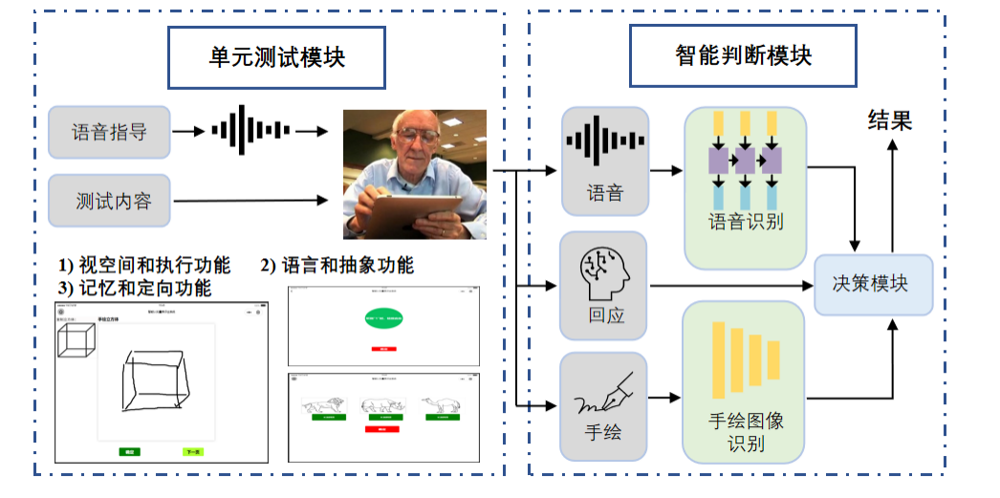

# CFM_HC
## HC-Paddle-Android

##### An app for healthcare(HC) 
##### This project provides a mobile terminal application for medical staff to conduct preliminary screening of patients with Alzheimer's disease. An interactive operation mode is built through Baidu voice interface, and the hand-drawn drawings of patients are evaluated through flying slurry framework.Compared with traditional methods, this method reduces the burden on doctors, improves the screening speed, and ensures the objectivity of the evaluation. 

##### Fig. 1 The structural framework of "an intelligent interactive Alzheimer's disease auxiliary screening system"

### Code

1. 
2.

### Show
#### 1.`AI Studio Project` 
#####  Visit our AI Studio Project 
#### 2.`BiliBili Video` 
#####  Visit BiliBili Video 
#### 3.`GitHub Page` 
#####  Visit our GitHub for Android Project 
#####  https://github.com/chenminupup/CFM_HC 
#### 3.`About us` 
#####  Visit our group page 
#####  https://github.com/chenminupup/CFM_HC 

### Reference
##### * PaddlePaddle
##### * PaddleLite

##### Copyright@UESTC,Min Chen,2021

